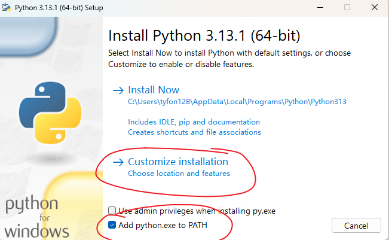
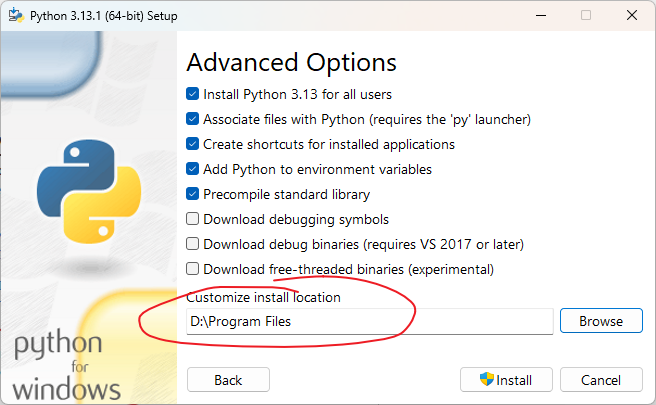
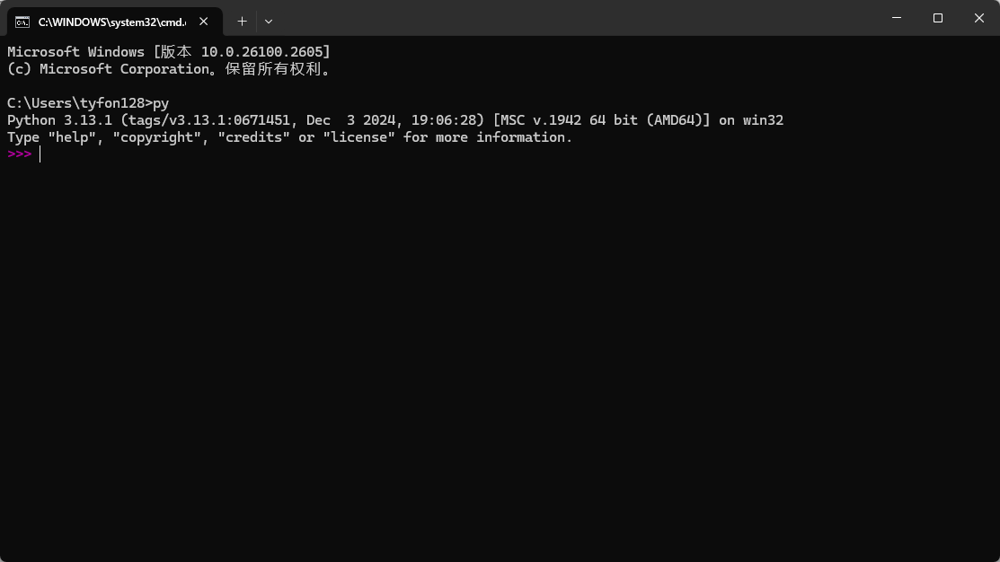
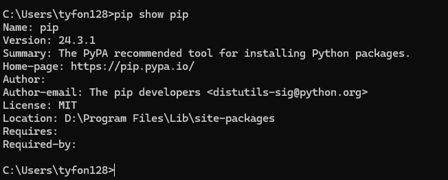

# 安装
	- 安装包地址
		- 官网[Welcome to Python.org](https://www.python.org/)
		- [国内地址](https://repo.huaweicloud.com/artifactory/python-local/3.13.1/)
	- 下载
		- 根据系统选择对应的版本
	- 安装
		- 选择自定义安装：
		- 
		- 自定义安装位置
		- 
	- 检查
		- `win+r`进入终端输入`py`或者`python`
		- 安装成功 
		- 查看pip是否安装成功
		- 