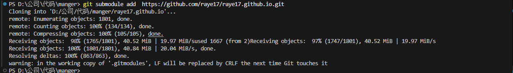
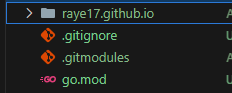
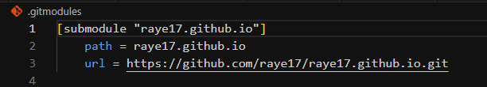
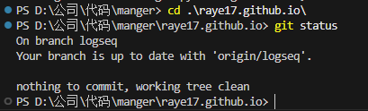

### git add
	- git add 添加多个文件，文件中间用空格隔开
	  logseq.order-list-type:: number
		- `git add file1 file2`
		  logseq.order-list-type:: number
	- 多次git add
	  logseq.order-list-type:: number
		- logseq.order-list-type:: number
		  ```
		  git add file1
		  git add file2
		  git add file3
		  ```
	- 添加指定目录下的文件
	  logseq.order-list-type:: number
		- logseq.order-list-type:: number
		  ```
		  # config目录下及子目录下所有文件，home目录下的所有.php文件
		  git add config/*
		  git add home/*.php
		  ```
	- git add文件夹名
	  logseq.order-list-type:: number
-
- ## subModule
  collapsed:: true
	- ### 为什么要subModule
		- **解决公共代码问题**。如果某些文件，在项目A和项目B中都会用到，例如组件库，那么这些文件可以作为 submodules 来管理，减少重复代码。（npm包是另一解决方案）
		- **解决团队维护难题**。如果一个大项目是一个大 Git 仓库，需要统一编译，不同的模块由不同团队维护，放在同一个 Git 仓库有诸多难处：例如多个团队的 MR 混在一起、权限难以区分等。这种情况即使公司内网 Git 权限做的足够精细，仓库管理员的学习成本也会很高，很难深度使用这种高级功能。为了解决多团队维护的难题，Git Submodules 也能大展身手，它可以让每个团队负责的模块就是一个 Git 仓库，这些 Git 仓库都被包含在同一个主 Git 项目下。（微前端、微服务是另一种解决方案。）
	- ### 了解SubModule
		- 一个仓库做另一个仓库的子模块，两者都是完整的git仓库
	- ### 创建SubModule
		- ```
		  ProjectA：git init 
		  ProjectB：git init
		  在A仓库下 
		  git submodule add (projectB地址；即git clone 后面的地址)
		  ```
		- **注意事项**
			- 执行操作后，会在当前父项目下新建个文件夹，名字就是 submodule 仓库的名字。文件夹里面的内容，**是 submodule 对应 Git 仓库的完整代码。**
			- 如果希望换个名字，或者换个路径（例如放在某个更深的目录下），也是允许的，需要后面增加个路径参数，例如`git submodule add ...(仓库地址) src/B(希望 submodule 位于的文件夹路径)`
		- {:height 176, :width 1161}
	- ### SubModule信息保存
	  collapsed:: true
		- 存在于主项目的`.gitmodule`文件里
		- 
		- 
		- 主项目还保存了对应 submodule 的版本号（commit id），没有冗余存储 submodule 的代码。
		- ### submodule 的父子关系存在哪里
			- 关系是保存在主项目的 Git 仓库中。
			- 被当作 submodule 的 Git 仓库，其实不知道自己变成了 submodule，它更不知道爸爸们有谁。（意思是，当打开某个被当作 submodule 的 Git 仓库首页时，或者拉下这个仓库时，没有任何痕迹表明它是个submodule。因为父子信息不存在这里，只存在爸爸那里。）
	- ### SubModule开发常用操作
		- 像普通项目一样更新
		  logseq.order-list-type:: number
		  collapsed:: true
			- 直接git clone 子项目，像普通仓库一样更新推送
			  logseq.order-list-type:: number
		- 在主项目更新
		  logseq.order-list-type:: number
		  collapsed:: true
			- 在主项目进入子模块对应的文件夹下进行git操作
			  logseq.order-list-type:: number
			- 
			  logseq.order-list-type:: number
		- ### SubModule更新
		  collapsed:: true
			- 方法一，主项目执行`git submodule update --remote [submodule文件夹相对路径]`
			  logseq.order-list-type:: number
			  collapsed:: true
				- 如果不带参数`[submodule文件夹相对路径]`，就会更新所有 submodules
				  logseq.order-list-type:: number
				- **注意事项**，更新后需提交主项目变更。
				  logseq.order-list-type:: number
				- 当更新子项目后，相当于是把主项目记录的 submodule 的 commit id 给更新了，需要提交下主项目的变更。
				  logseq.order-list-type:: number
			- 方法二，cd submodule后进行git pull
			  logseq.order-list-type:: number
			- 方法三，主项目执行  `git submodule update [submodule文件夹相对路径]`
			  logseq.order-list-type:: number
				- **注意**，该方法会使 submodule 的分支处于主项目里指定的 commit id。可能并不是拉 submodule 的 master 最新代码。
				  logseq.order-list-type:: number
				- 所以，这种方法仅适用于，当主仓库里记录的 submodule 的 commit id 已经是最新的（可能被其他同事提交过）。或者期望 submodule 跟主仓库记录的保持一致时，也可以使用该方法。
				  logseq.order-list-type:: number
		- ### SubModule删除
			- ```
			  git rm --cached submoduleA
			  rm -rf submoduleA
			  rm .gitmodules
			  vim .git/config
			  ```
	- ### 克隆包含SubModule的仓库
	  collapsed:: true
		- **方法一**，按需clone submodule
			- 先`git clone `主项目仓库并进入主项目文件夹，这时候submodule的文件夹都是空的。
			  logseq.order-list-type:: number
			- 执行`git submodule init [submodule的文件夹的相对路径]`。
			  logseq.order-list-type:: number
			- 执行`git submodule update [submodule的文件夹的相对路径]`。
			  logseq.order-list-type:: number
			- 这就按需clone了submodule。跨团队协作某个主项目时，一些其它团队的submodule没必要安装，就不必执行init和update了。
			- 合并第2、3步骤: 第2、3步可以合并。使用命令：`git submodule update --init [submodule的文件夹的相对路径]`
			- 注意顺序，--init跟[submodule的文件夹的相对路径]的位置不可以调换。
		- **方法二**，一次性clone所有 submodule
			- 先`git clone `主项目仓库，这时候submodule的文件夹都是空的。
			  logseq.order-list-type:: number
			- 执行`git submodule init`。
			  logseq.order-list-type:: number
			- 执行`git submodule update`。
			  logseq.order-list-type:: number
			- 只要不写submodule，那么就一次性检查该主项目的所有submodule，都拉下来。
			- 合并第2、3步骤:`git submodule update --init`
			- 合并第1、2、3步骤:`git clone --recurse-submodules [主项目Git仓库地址]`
	- ### 常用命令参考
	  collapsed:: true
		- ```
		  git clone  --recursive //递归的方式克隆整个项目, 包含子项目
		  git submodule add   //添加子模块
		  git submodule init //初始化子模块
		  git submodule update //更新子模块
		  git submodule foreach git pull //拉取所有子模块
		  ```
	- ### 官方Api
	  collapsed:: true
		- ```git submodule [--quiet] add [] [--]  []
		  git submodule [--quiet] status [--cached] [--recursive] [--] […​]
		  git submodule [--quiet] init [--] […​]
		  git submodule [--quiet] deinit [-f|--force] (--all|[--] …​)
		  git submodule [--quiet] update [] [--] […​]
		  git submodule [--quiet] summary [] [--] […​]
		  git submodule [--quiet] foreach [--recursive] 
		  git submodule [--quiet] sync [--recursive] [--] […​]
		  git submodule [--quiet] absorbgitdirs [--] […​]
		  ```
	- ### 参考链接
		- [菜鸟教程](https://www.runoob.com/git/git-submodule.html)
	-
- ## 仓库
	-
- ## 分支
  collapsed:: true
	- ### 新建分支
	  collapsed:: true
		- ```
		  #第一步，切换到指定的分支。如从dev上拉一个分支
		  git checkout dev 
		  #第二步，拉取dev的最新代码
		  git pull
		  #第三步，在本地创建一个test分支，并切换到该分支。此时执行git branch会看到该分支在本地已创建
		  git checkout -b test 
		  #第四步，把分支推到远程仓库。此时执行git branch -av可以看到该分支在远程仓库也有了
		  git push origin test
		  #第五步，将本地分支与远程分支关联
		  git branch --set-upstream-to=origin/test test
		  ```
			-
	- ### 删除分支
		- ```
		  删除远程分支：
		  git push origin --delete <branch-name>
		  删除本地分支：
		  git branch -d <branch-name>
		  如果该分支没有被完全合并，可以使用强制删除：
		  git branch -D <branch-name>
		  ```
-
- ## merge
	- ### 冲突
		- 在Git中，如果在执行`git merge`时遇到了冲突，并且希望取消这次合并操作，有以下几种方法：
		- #### 方法一：使用 `git merge --abort`
		  collapsed:: true
			- ```bash
			  git merge --abort
			  这是最直接的方法，它会尝试撤销合并操作并恢复到合并前的状态。
			  ```
		- #### 方法二：使用 `git reset`
		  collapsed:: true
			- ```bash
			  git reset --merge
			  如果已经解决了部分冲突并提交了这些更改，或者`git merge --abort`无法正常运行，可以使用`git reset`来撤销合并。
			  ```
		- #### 方法三：使用 `git reset --hard`
		  collapsed:: true
			- ```bash
			  git reset --hard
			  如果希望完全撤销合并并恢复到合并前的状态，可以使用`git reset --hard`。请注意，这种方法会丢失所有未提交的更改，因此请谨慎使用。
			  ```
		- #### 方法四：使用 `git reflog`
			- ```bash
			  git reflog
			  如果已经解决了部分冲突并希望保留这些更改，但仍然希望取消合并，可以使用`git reflog`找到合并前的提交哈希值，然后使用`git reset`或`git checkout`回到那个状态。
			  找到合并前的提交哈希值，然后使用：
			  git reset --hard <commit-hash>
			  或者
			  git checkout <commit-hash>
			  ```
			-
		- #### 总结
		- `git merge --abort`：尝试自动撤销合并。
		- `git reset --merge`：撤销合并但保留未解决的冲突。
		- `git reset --hard`：完全撤销合并并丢弃所有未提交的更改。
		- `git reflog`：手动找到合并前的状态并恢复。